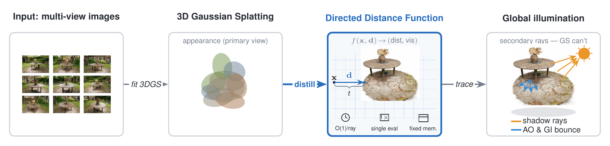

# Directed Distance Fields for Constant-Time Ray Queries on Gaussian Splatting

> Distil a small neural field (a Directed Distance Function, or DDF) from a trained
> 3D Gaussian Splatting scene. The DDF answers any ray in one network evaluation,
> with cost and memory that do not grow with the number of Gaussians. We use it as
> a secondary-ray oracle for shadows, ambient occlusion, and global illumination on
> Gaussian Splatting and implicit scenes.

<p align="center">
  
</p>

## What this is

A rasterizer like 3D Gaussian Splatting (3DGS) only answers primary rays. Shadows,
ambient occlusion, and global illumination need *secondary* rays with arbitrary
origins and directions. There are two existing ways to add ray queries to a GS
scene, and both have a cost:

- Build a **bounding volume hierarchy (BVH)** over the Gaussians and traverse it on
  ray-tracing cores. Memory and traversal time grow with the Gaussian count.
- Fit a **signed distance field (SDF)** and sphere-trace it. Each ray needs many
  sequential network evaluations.

This repo takes a third way: distil a **Directed Distance Function** `f(x, d) ->
(t, ξ)` from the trained GS scene. Each ray is one forward pass. The field is
52 MB and its size does not depend on the number of Gaussians.

## Headline results

| | DDF (ours) | BVH on RT cores | BVH on CPU (Embree) |
|---|:---:|:---:|:---:|
| per-ray latency, 1M Gaussians, 100K rays | **0.005 µs** | 0.009 µs | 6.96 µs |
| per-ray latency, 1M Gaussians, 1M rays | **0.003 µs** | 0.008 µs | 6.53 µs |
| memory, 1M Gaussians | **52 MB (flat)** | 336 MB | 336 MB |
| scales with `N_gaussians`? | **no** | yes | yes |
| needs RT-core hardware? | **no** | yes | no |
| query mode | **one forward pass** | iterative BVH traverse | iterative BVH traverse |

Plus:

- **26 to 72 times faster than sphere-tracing an equivalent NeuS SDF** for the same
  ray query.
- **Mesh-free pipeline**: images → 3DGS + NeuS → DDF, no mesh at any stage. The DDF
  reproduces reference ray-traced shadows at **30.3 dB** and ambient occlusion at
  **21.3 dB** across 142 objects.

The full paper is at [paper/main.pdf](paper/main.pdf); supplemental material
including the per-object table and a turntable video of GI on a real captured scene
is in [paper/](paper/).

## Setup

Tested with Python 3.10, PyTorch 2.5, CUDA 12.1.

```bash
conda create -n ddfgs python=3.10
conda activate ddfgs
pip install -r requirements.txt
```

Optional, only for specific tooling:

- **tinycudann** for the CUDA-fused DDF that beats the BVH at scene scale.
  Install per the upstream instructions; needs a compatible CUDA toolkit.
- **mitsuba 3** for the OptiX/RT-core BVH benchmark
  (`scripts/bench_ddf_vs_bvh_mitsuba.py`). Requires an RTX GPU with `libnvoptix.so.1`.
- **nerfstudio + tinycudann** for the NeuS comparison
  (`scripts/sota_train_neus.py`).

Datasets used in the paper:

- [Google Scanned Objects (GSO)](https://app.gazebosim.org/GoogleResearch/fuel/collections/Scanned%20Objects%20by%20Google%20Research)
- [ShapeNet](https://shapenet.org/) (subset, see `configs/`)
- [Mip-NeRF 360](https://jonbarron.info/mipnerf360/) (real captured scenes)

Place under `data/gso/`, `data/shapenet/`, and `data/mip_nerf/` respectively.

## Quick start

Train a DDF on one object (the canonical Schleich Hereford Bull from GSO):

```bash
python -m src.train_ddf --config configs/bull_hashgrid_kitchensink.yaml
```

Extract a surface via sphere-tracing the trained DDF:

```bash
python scripts/sphere_trace_extract.py --objects bull
```

Benchmark per-ray query latency vs. a BVH over the Gaussians:

```bash
python scripts/bench_ddf_vs_bvh.py --reps 10                  # CPU Embree BVH
python scripts/bench_ddf_vs_bvh_mitsuba.py                    # OptiX/RT-core BVH
python scripts/bench_ddf_tcnn.py                              # tinycudann-fused DDF
```

Run global illumination with the DDF as the secondary-ray oracle, against a
reference embree ray tracer:

```bash
python scripts/gi_render_eval.py --obj bull
```

## Reproducing the paper

| Result | Script |
|---|---|
| Per-ray latency, DDF vs. BVH (Table I, Fig 3) | `bench_ddf_vs_bvh.py`, `bench_ddf_vs_bvh_mitsuba.py`, `bench_ddf_tcnn.py`, `fig_scaling.py` |
| DDF vs. NeuS-SDF sphere-tracing (Table II) | `bench_ddf_vs_sdf.py` |
| Supervision study (Table III) | `pregenerate_gtmesh_cache.py` + `src.train_ddf` + `sphere_trace_extract.py` |
| Encoding ablation (Table IV) | `src.train_ddf` on `configs/bull_{hashgrid,small,medium}.yaml` |
| Mesh-free secondary-ray oracle (Table V) | `pregenerate_neus_omnidir_data.py` + `e1_shadow_agreement.py` |
| GI at scale, 142 objects (Table VI) | `gi_render_eval.py` + `e4_gi_summary.py` |
| GI hero figure (Fig 4) | `gi_hero_figure.py` |
| Real-scene GI (Fig 5) | `gi_garden.py`, `assemble_realscene.py` |
| NeuS baseline | `sota_run_30k.py` (needs nerfstudio) |
| Classical baselines (TSDF, Poisson) | `stage10_classical_baselines.py` |

## Repo layout

```
src/         model + supervisors + training (importable as a package)
scripts/     benchmark, eval, figure-generation, demo scripts
configs/     YAML configs, one per experiment
paper/       compiled paper + supplemental + GI video
figures/     key figures used in the paper
```

## Citation

```bibtex
@article{mishra2026ddfgs,
  title  = {Directed Distance Fields for Constant-Time Ray Queries on
            Gaussian Splatting},
  author = {Mishra, Subhankar},
  year   = {2026},
  note   = {arXiv preprint}
}
```

Builds on earlier work from the same group on directed distance fields:
[Behera and Mishra (2023)](https://arxiv.org/abs/2306.16142).

## License

MIT — see [LICENSE](LICENSE).

## Acknowledgments

This work was supported by the Department of Atomic Energy, Government of India,
under grant **RIN4009**.
